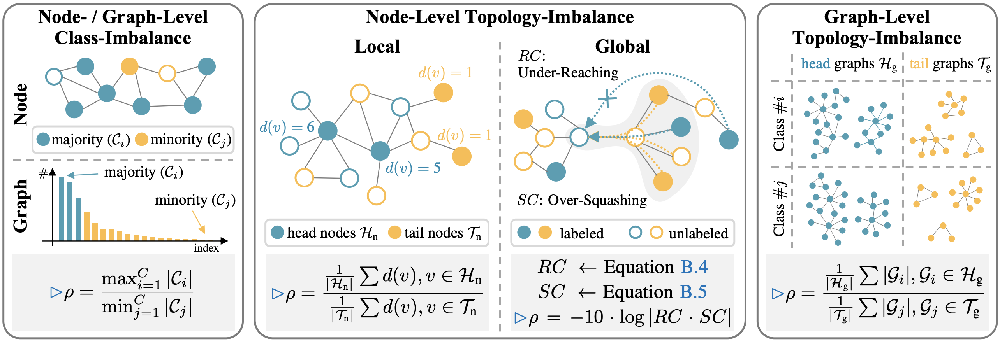

<p align="center">

</p>

---

# IGL-Bench: Establishing the Comprehensive Benchmark for Imbalanced Graph Learning (ICLR 2025 Spotlight🌟) [[PDF](https://arxiv.org/pdf/2406.09870)]

IGL-Bench is a comprehensive benchmark for Imbalanced Graph Learning (IGL) based on [PyTorch](https://pytorch.org/) and [PyTorch Geometric](https://www.pyg.org/). We embark on **16** diverse graph datasets and **24** distinct IGL algorithms with uniform data processing and splitting strategies.

## 📔 Overview of the IGL-Bench

<p align="center">

</p>
<p align="center">

</p>

IGL-Bench serves as the **first** open-sourced benchmark for graph-specific imbalanced learning to the best of our knowledge. IGL-Bench encompases **24 state-of-the-art IGL algorithms** and **16 diverse graph datasets** covering **node-level** and **graph-level** tasks, addressing **class- and topology-imbalance** issues, while also adopting consistent data processing and splitting approaches for fair comparisons over multiple metrics with different investigation focus. Through benchmarking the existing IGL algorithms for effectiveness, robustness, and efficiency, we make the following contributions:

- **First Comprehensive IGL Benchmark.** IGL-Bench enables a fair and unified comparison among 19 state-of-the-art node-level and 5 graph-level IGL algorithms by unifying the experimental settings across 16 graph datasets of diverse characteristics, providing a comprehensive understanding of the class-imbalance and topology-imbalance problems in IGL for the first time.
- **Multi-faceted Evaluation and Analysis.** We conduct a systematic analysis of IGL methods from various dimensions, including effectiveness, efficiency, and complexity. Based on the results of extensive experiments, we uncover both the potential advantages and limitations of current IGL algorithms, providing valuable insights to guide future research endeavors.
- **Open-sourced Package.** To facilitate future IGL research, we develop an open-sourced benchmark package for public access. Users can evaluate their algorithms or datasets with less effort.

## 📦 Installation

Follow the steps below to install and configure **IGL-Bench** properly for your local environment.

#### Environment Requirements

Please ensure your Python environment meets  following dependencies:


| Dependency        | Version (≥) |
| ----------------- | ------------ |
| Python            | 3.8.12       |
| PyTorch           | 1.9.1        |
| PyTorch-Geometric | 2.0.1        |
| DGL               | 1.1          |
| scipy             | 1.9          |

> **Recommendation:** Use your specific Python virtual environment (e.g., via `conda` or `venv`) or use this [`Dockerfile`](./Dockerfile)we provide to build a Docker image.

#### [Recommended] Installation Steps

Clone the repository and install required dependencies:

```bash
# Clone the repository
git clone https://github.com/RingBDStack/IGL-Bench.git
cd IGL-Bench

# Install dependencies
pip install -r requirements.txt
```

#### [Optional] Development Mode Installation

If you want to install the package for your local development, use:

```bash
pip install -e .
```

## 🚀 Quick Start

<p align="center">

</p>

The following demonstrates how to quickly run algorithms from IGL-Bench for both **node-level** and **graph-level** classification tasks under various imbalance settings.

You can also refer to our runnable example :
📓 [demo.ipynb](./demo.ipynb)

### 🔹 Node-Level Task (e.g., PASTEL on Cora)

#### Step 1: Import Package

```python
import IGL_Bench as igl
```

#### Step 2: Initialize Dataset

```python
Dataset = igl.dataset.Dataset(
    task="node",
    data_name="Cora",
    imb_type="topo_global",
    imb_level="high"
)
dataset = Dataset.load_dataset()
```

#### Step 3: Load Configuration

```python
config = igl.config.load_conf(
    task="node",
    imbtype="topo_global",
    algorithm="PASTEL"
)
```

#### Step 4: Run Solver

```python
solver = igl.manage.Manager(config, dataset)
solver.run(num_runs=5)
```

### 🔸 Graph-Level Task (e.g., G2GNN on D&D)

#### Step 1: Import Package

```python
import IGL_Bench as igl
```

#### Step 2: Initialize Dataset

```python
Dataset = igl.dataset.Dataset(
    task="graph",
    data_name="D&D",
    imb_type="class",
    imb_level="low"
)
dataset = Dataset.load_dataset()
```

#### Step 3: Load Configuration

```python
config = igl.config.load_conf(
    task="graph",
    imbtype="class",
    algorithm="G2GNN"
)
```

#### Step 4: Run Solver

```python
solver = igl.manage.Manager(config, dataset)
solver.run(num_runs=10)
```

## ⚙️ Configuration Argument Options

You can flexibly configure algorithms using the `Dataset(...)` and `load_conf(...)` API with the following parameters:

#### `task`

Specifies the type of task:

```
'node' or 'graph'
```

#### `data_name`

Node-level datasets:

```
'Cora', 'CiteSeer', 'PubMed', 'Computers', 'Photo', 'ogbn-arxiv', 'Chameleon', 'Squirrel', 'Actor'
```

Graph-level datasets:

```
'PTC-MR', 'FRANKENSTEIN', 'PROTEINS', 'D&D', 'IMDB-B', 'REDDIT-B', 'COLLAB', 'ogbg-molhiv'
```

#### `imbtype`

Imbalance type (depends on task):

- For node-level:
  ```
  'class', 'topo_local', 'topo_global'
  ```
- For graph-level:
  ```
  'class', 'topology'
  ```

#### `imb_level`

Controls the severity of imbalance:

```
'low', 'mid', 'high'
```

#### `algorithm`

The algorithm to run. Supported algorithms include:

- **Node-level class imbalance:**

  ```
  DRGCN, DPGNN, ImGAGN, GraphSMOTE, GraphENS, GraphMixup, LTE4G, TAM, TOPOAUC, GraphSHA
  ```
- **Node-level topology local imbalance:**

  ```
  DEMONet, TailGNN, COLDBREW, LTE4G, meta-tail2vec, GRAPHPATCHER, RAWLSGCN
  ```
- **Node-level topology global imbalance:**

  ```
  ReNode, TAM, PASTEL, TOPOAUC, HyperIMBA
  ```
- **Graph-level class imbalance:**

  ```
  G2GNN, TopoImb, DataDec, ImGKB
  ```
- **Graph-level topology imbalance:**

  ```
  TopoImb, SOLTGNN
  ```

You can also **manually modify the configuration files** located in [`config/`](./config) for fine-grained control over hyperparameters.

## 🚧 Build Your Own IGL Algorithms

IGL-Bench is designed with modularity and extensibility.
Due to the **unified solver interface**, users can seamlessly integrate their **custom algorithms** into our benchmarking pipeline with minimal redundant codes.

We provide a step-by-step tutorial to guide you through the process:
📓 [Build_Your_Own_IGL.ipynb](./Build_Your_Own_IGL.ipynb)

This tutorial covers:

- ✅ Using the **pre-split datasets** (with `train_mask`, `val_mask`, `test_mask`)
- ✅ Understanding the `Dataset` and `Config` structure
- ✅ **Adding your own algorithm** in a few easy steps

Your custom solver will automatically be discovered and benchmarked by the framework—just like any built-in baseline.

## 🧩 Algorithm References

We have implemented the following IGL algorithms in the IGL-Bench:


| Algorithm        | Conference/Journal | Imbalance Type                  | TASK | Paper                                                                                                                                                                                                                                     | Code                                                                                                                      |
| ---------------- | ------------------ | ------------------------------- | :---: | ----------------------------------------------------------------------------------------------------------------------------------------------------------------------------------------------------------------------------------------- | ------------------------------------------------------------------------------------------------------------------------- |
| DRGCN            | IJCAI 2020         | Class-Imbalance                 |  NC  | [Multi-Class Imbalanced Graph Convolutional Network Learning](https://par.nsf.gov/servlets/purl/10199469)                                                                                                                                 | [Link](https://github.com/codeshareabc/DRGCN)                                                                             |
| DPGNN            | arXiv 2020         | Class-Imbalance                 |  NC  | [Distance-wise Prototypical Graph Neural Network for Imbalanced Node Classification](https://arxiv.org/pdf/2110.12035)                                                                                                                    | [Link](https://github.com/YuWVandy/DPGNN)                                                                                 |
| ImGAGN           | SIGKDD 2021        | Class-Imbalance                 |  NC  | [ImGAGN: Imbalanced Network Embedding via Generative Adversarial Graph Networks](https://arxiv.org/pdf/2106.02817)                                                                                                                        | [Link](https://github.com/Leo-Q-316/ImGAGN)                                                                               |
| GraphSMOTE       | WSDM 2021          | Class-Imbalance                 |  NC  | [GraphSMOTE: Imbalanced Node Classification on Graphs with Graph Neural Networks](https://arxiv.org/pdf/2103.08826)                                                                                                                       | [Link](https://github.com/TianxiangZhao/GraphSmote)                                                                       |
| GraphENS         | ICLR 2021          | Class-Imbalance                 |  NC  | [Graphens: Neighbor-aware ego network synthesis for class-imbalanced node classification](https://openreview.net/pdf?id=MXEl7i-iru)                                                                                                       | [Link](https://github.com/JoonHyung-Park/GraphENS)                                                                        |
| GraphMixup       | ECML PKDD 2022     | Class-Imbalance                 |  NC  | [GraphMixup: Improving Class-Imbalanced Node Classification on Graphs by Self-supervised Context Prediction](https://arxiv.org/pdf/2106.11133)                                                                                            | [Link](https://github.com/LirongWu/GraphMixup)                                                                            |
| LTE4G            | CIKM 2022          | Class/Local Topology-Imbalance  |  NC  | [LTE4G: Long-Tail Experts for Graph Neural Networks](https://arxiv.org/pdf/2208.10205)                                                                                                                                                    | [Link](https://github.com/SukwonYun/LTE4G)                                                                                |
| TAM              | ICML 2022          | Class/Global Topology-Imbalance |  NC  | [TAM: Topology-Aware Margin Loss for Class-Imbalanced Node Classification](https://proceedings.mlr.press/v162/song22a/song22a.pdf)                                                                                                        | [Link](https://github.com/Jaeyun-Song/TAM)                                                                                |
| TOPOAUC          | ACM MM 2022        | Class/Global Topology-Imbalance |  NC  | [A Unified Framework against Topology and Class Imbalance](https://dl.acm.org/doi/pdf/10.1145/3503161.3548120)                                                                                                                            | [Link](https://github.com/TraceIvan/TOPOAUC)                                                                              |
| GraphSHA         | SIGKDD 2023        | Class-Imbalance                 |  NC  | [GraphSHA: Synthesizing Harder Samples for Class-Imbalanced Node Classification](https://arxiv.org/pdf/2306.096)                                                                                                                          | [Link](https://github.com/wenzhilics/GraphSHA)                                                                            |
| DEMO-Net         | SIGKDD 2019        | Local Topology-Imbalance        |  NC  | [DEMO-Net: Degree-specific Graph Neural Networks for Node and Graph Classification](https://arxiv.org/pdf/1906.02319)                                                                                                                     | [Link](https://github.com/junwu6/DEMO-Net)                                                                                |
| meta-tail2vec    | CIKM 2020          | Local Topology-Imbalance        |  NC  | [Towards locality-aware meta-learning of tail node embeddings on networks](https://ink.library.smu.edu.sg/cgi/viewcontent.cgi?article=6299&context=sis_research)                                                                          | [Link](https://github.com/smufang/meta-tail2vec)                                                                          |
| Tail-GNN         | SIGKDD 2021        | Local Topology-Imbalance        |  NC  | [Tail-GNN: Tail-Node Graph Neural Networks](https://www.researchgate.net/profile/Yuan-Fang-34/publication/353907852_Tail-GNN_Tail-Node_Graph_Neural_Networks/links/6369b11654eb5f547cb0c0bd/Tail-GNN-Tail-Node-Graph-Neural-Networks.pdf) | [Link](https://github.com/shuaiOKshuai/Tail-GNN)                                                                          |
| Cold Brew        | ICLR 2022          | Local Topology-Imbalance        |  NC  | [Cold Brew: Distilling Graph Node Representations with Incomplete or Missing Neighborhoods](https://arxiv.org/pdf/2111.04840)                                                                                                             | [Link](https://github.com/amazon-science/gnn-tail-generalization)                                                         |
| RawlsGCN         | WWW 2022           | Local Topology-Imbalance        |  NC  | [RawlsGCN: Towards Rawlsian Difference Principle on Graph Convolutional Network](https://dl.acm.org/doi/pdf/10.1145/3485447.3512169)                                                                                                      | [Link](https://github.com/jiank2/RawlsGCN)                                                                                |
| GraphPatcher     | NeuIPS 2023        | Local Topology-Imbalance        |  NC  | [GRAPHPATCHER: Mitigating Degree Bias for Graph Neural Networks via Test-time Augmentation](https://proceedings.neurips.cc/paper_files/paper/2023/file/ae9bbdcea94d808882f3535e8ca00542-Paper-Conference.pdf)                             | [Link](https://github.com/jumxglhf/GraphPatcher)                                                                          |
| ReNode           | NeurIPS 2021       | Global Topology-Imbalance       |  NC  | [Topology-Imbalance Learning for Semi-Supervised Node Classification](https://proceedings.neurips.cc/paper/2021/file/fa7cdfad1a5aaf8370ebeda47a1ff1c3-Paper.pdf)                                                                          | [Link](https://github.com/victorchen96/ReNode)                                                                            |
| PASTEL           | CIKM 2022          | Global Topology-Imbalance       |  NC  | [Position-aware Structure Learning for Graph Topology-imbalance by Relieving Under-reaching and Over-squashing](https://dl.acm.org/doi/pdf/10.1145/3511808.3557419)                                                                       | [Link](https://github.com/RingBDStack/PASTEL)                                                                             |
| HyperIMBA        | WWW 2023           | Global Topology-Imbalance       |  NC  | [Hyperbolic Geometric Graph Representation Learning for Hierarchy-imbalance Node Classification](https://arxiv.org/pdf/2304.05059)                                                                                                        | [Link](https://github.com/RingBDStack/HyperIMBA)                                                                          |
| G<sup>2</sup>GNN | CIKM 2022          | Class-Imbalance                 |  GC  | [Imbalanced Graph Classification via Graph-of-Graph Neural Networks](https://arxiv.org/pdf/2112.00238)                                                                                                                                    | [Link](https://github.com/submissionconff/G2GNN)                                                                          |
| TopoImb          | LOG 2022           | Class/Topology-Imbalance        | NC/GC | [TopoImb: Toward Topology-level Imbalance in Learning from Graphs](https://proceedings.mlr.press/v198/zhao22b/zhao22b.pdf)                                                                                                                | [Link](https://github.com/zihan448/TopoImb)                                                                               |
| DataDec          | ICML 2023          | Class-Imbalance                 | NC/GC | [When Sparsity Meets Contrastive Models: Less Graph Data Can Bring Better Class-Balanced Representations](https://proceedings.mlr.press/v202/zhang23o/zhang23o.pdf)                                                                       | [Link](https://www.dropbox.com/scl/fo/7jsv166zgve1vcbno15xo/AKEAQca4afpx5W8Z1ydoMRw?rlkey=umorleemawazju4p06ak2az4i&dl=0) |
| ImGKB            | ACM MM 2023        | Class-Imbalance                 |  GC  | [Where to Find Fascinating Inter-Graph Supervision: Imbalanced Graph Classification with Kernel Information Bottleneck](https://dl.acm.org/doi/pdf/10.1145/3581783.3612039)                                                               | [Link](https://github.com/Tommtang/ImGKB)                                                                                 |
| SOLT-GNN         | WWW 2022           | Class-Imbalance                 |  GC  | [On Size-Oriented Long-Tailed Graph Classification of Graph Neural Networks](https://zemin-liu.github.io/papers/SOLT-GNN-WWW-22.pdf)                                                                                                      | [Link](https://github.com/shuaiOKshuai/SOLT-GNN)                                                                          |
## 📚 Citation
If you find this repository helpful, please consider citing us. We welcome any discussions with [qinjw@buaa.edu.cn](mailto:qinjw@buaa.edu.cn).

```bibtex
@inproceedings{qin2025iglbench,
  title={{IGL}-Bench: Establishing the Comprehensive Benchmark for Imbalanced Graph Learning},
  author={Jiawen Qin and Haonan Yuan and Qingyun Sun and Lyujin Xu and Jiaqi Yuan and Pengfeng Huang and Zhaonan Wang and Xingcheng Fu and Hao Peng and Jianxin Li and Philip S. Yu},
  booktitle={The Thirteenth International Conference on Learning Representations},
  year={2025}
}
```
